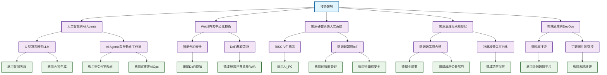

# Coscup 2025 趨勢總覽

## 趨勢一：人工智慧與 AI Agents 的深化與普及

### 子趨勢：大型語言模型（LLM）與生成式 AI
- **總覽與建議**：
  - 趨勢從通用模型轉向專用化與效率化。透過模型微調（fine-tuning）、極致量化（如 BitNet）和特定領域資料（如國會逐字稿、台灣在地語料），打造更精準、更輕量的 AI 應用。開發者應關注如何將開源模型（如 Gemma）與自有資料結合，解決特定場景問題。
- **應用場景**：
  - **智慧客服與助理**：結合 n8n、LangChain 等工具打造自動化問答系統。
  - **內容生成與分析**：自動生成國會逐字稿、分析網路監控數據、撰寫部落格。
  - **企業內部應用**：處理個資過濾、文件摘要等敏感資訊。
  - **開發輔助**：利用 Vibe Coding、Copilot 等工具加速程式碼生成與原型開發。
- **潛在影響**：
  - 大幅降低特定領域 AI 應用的開發門檻，實現「人人皆可 AI」。
  - 推動從雲端 AI 到裝置端（Edge AI）的轉移，保護資料隱私。
- **關鍵挑戰**：
  - **模型幻覺（Hallucination）**：生成的內容仍需驗證，需要建立可控的工作流。
  - **運算資源與成本**：模型量化與優化是普及化的關鍵。
  - **資料隱私與安全**：企業導入時需謹慎處理敏感資料。
- **相關工具／平台**：
  - **模型**：Gemma, Llama, Whisper, open models
  - **框架與函式庫**：PyTorch, TensorFlow Lite, LangChain, Dify.ai, Spring AI, GenKit, JAX, ONNX
  - **開發與部署**：Hugging Face, Ollama, KubeRay, KitOps, Cosign
  - **工作流自動化**：n8n, MCP (Model Context Protocol)

### 子趨勢：AI Agents 與自動化工作流
- **總覽與建議**：
  - AI 正從「單點工具」演進為「自動化流程」。以 Agent 為核心，串連多種工具與資料來源，實現如專案管理、監控查詢等複雜任務。Model Context Protocol (MCP) 作為新興標準，旨在統一 Agent 間的通訊，降低整合難度。
- **應用場景**：
  - **辦公室自動化**：打造 AI 專案經理（AI PM），自動化任務分配與進度追蹤。
  - **IT 維運（AIOps）**：用自然語言查詢 Prometheus 監控數據。
  - **區塊鏈分析**：自動抓取鏈上資料並產生分析報告。
- **潛在影響**：
  - 將重複性高的知識型工作自動化，提升生產力。
  - 催生新一代「意圖導向」的應用程式介面。
- **關鍵挑戰**：
  - **多 Agent 協作**：如何設計有效的狀態管理與溝通機制。
  - **工具整合的複雜性**：需要標準化協定（如 MCP）來簡化開發。
  - **安全性與可靠性**：Agent 的自主行為可能帶來未預期的風險。
- **相關工具／平台**：
  - **框架**：LangGraph, CrewAI, OpenAI Agent SDK, Strands Agents SDK
  - **協定**：MCP (Model Context Protocol), AITP (Agent Interaction & Transaction Protocol)
  - **整合工具**：n8n, Neo4j, Python

## 趨勢二：Web3 與去中心化技術

### 子趨勢：智能合約安全與形式化驗證
- **總覽與建議**：
  - 隨著 DeFi 複雜度提升，傳統測試已不足以保障資產安全。形式化驗證（Formal Verification）與 AI 輔助靜態分析成為新的防禦重點，從數學與邏輯層面根除漏洞。重入攻擊（Reentrancy）等經典漏洞依然是威脅，開發者需建立「狀態不變性」的設計思維。
- **應用場景**：
  - **DeFi 協議開發**：在上鏈前進行高精度的邏輯驗證。
  - **安全審計**：利用 AI Prompt Engineering 輔助檢測傳統工具難以發現的漏洞。
- **潛在影響**：
  - 提高鏈上資產的安全性與使用者信任度。
- **關鍵挑戰**：
  - **重入攻擊**：狀態更新與外部呼叫的順序錯置問題。
  - **邏輯漏洞**：僅靠單元測試無法完全覆蓋。
  - **開發者門檻**：形式化驗證工具學習曲線較陡。
- **相關工具／平台**：
  - **驗證工具**：Certora (CVL)
  - **攻擊防禦**：Checks-Effects-Interactions (CEI) 模式, FREI-PI 模式

### 子趨勢：DeFi 基礎設施與代幣標準創新
- **總覽與建議**：
  - DeFi 樂高組合性持續演進。Uniswap V4 的 Hook 機制、L2 Sequencer 的多樣化設計、EigenLayer 的再質押（Restaking）與懲罰（Slashing）機制，都為 DeFi 帶來更多可能性。ERC-4626 已成主流，而針對現實世界資產（RWA）的 ERC-3643 等新標準也開始受到關注。
- **應用場景**：
  - **資產代幣化（RWA）**：將證券、債券等現實資產上鏈。
  - **流動性挖礦與收益策略**：透過 ERC-4626 打造標準化的收益金庫。
  - **去中心化排序**：L2 項目方可自訂交易排序機制，平衡效率與去中心化。
- **潛在影響**：
  - 降低 DeFi 協議的開發成本，加速創新。
  - 將傳統金融資產引入區塊鏈，擴大市場規模。
- **關鍵挑戰**：
  - **複雜性增加**：新機制（如 Hook, Slashing）帶來新的安全風險。
  - **中心化風險**：中心化 Sequencer 或 Solver 可能引發審查或單點故障。
- **相關工具／平台**：
  - **協議**：Uniswap V4, EigenLayer
  - **代幣標準**：ERC-20, ERC-4626, ERC-3643, ERC-1271
  - **鏈**：Ethereum (EVM), Solana

## 趨勢三：開源硬體與嵌入式系統

### 子趨勢：RISC-V 生態系的快速發展
- **總覽與建議**：
  - RISC-V 正從學術走向商業應用，涵蓋從低功耗 IoT 裝置到具備 50 TOPS 算力的 AI PC。生態系強調開源協作，如 DeepComputing 與 Canonical (Ubuntu) 的合作，以及 Ocelot 專案展示的模組化設計，正加速硬體創新。
- **應用場景**：
  - **AI 個人電腦（AI PC）**：能夠本地運行大型語言模型。
  - **模組化筆電**：如 Framework Laptop，允許使用者自訂與升級主機板。
  - **開源硬體開發**：從 CPU 模擬器到 SoC 設計，吸引更多開發者投入。
- **潛在影響**：
  - 打破現有處理器架構的壟斷，提供更具彈性與透明度的硬體選擇。
  - 催生為特定需求（如隱私保護）設計的客製化硬體。
- **關鍵挑戰**：
  - **軟硬體整合**：需要大量投入才能克服軟體生態系的障礙。
  - **供應鏈成熟度**：相較於成熟架構，RISC-V 的供應鏈仍在發展中。
- **相關工具／平台**：
  - **硬體**：Framework Laptop, DeepComputing Laptop, Sparrow Hawk
  - **社群與組織**：RISC-V International, 一生一芯
  - **模擬器/工具**：Tenstorrent Whisper, QEMU

### 子趨勢：開源韌體（Open Firmware）與物聯網（IoT）
- **總覽與建議**：
  - 韌體層的開源成為趨勢，OpenBMC、coreboot、EDK II 等專案提升了伺服器與嵌入式系統的透明度與安全性。在 IoT 領域，低成本開發板（如 Raspberry Pi, ESP8266）結合開源軟體，讓開發者能快速打造從攻擊工具到部落格伺服器的多樣化應用。
- **應用場景**：
  - **伺服器管理**：使用 OpenBMC 進行遠端除錯與管理。
  - **安全啟動（Secure Boot）**：利用自有金鑰簽署 Kernel，提升系統安全性。
  - **物聯網安全研究**：以 Raspberry Pi 打造低成本物聯網攻擊工具（HackMaster Pi）。
  - **輕量級應用**：使用 mruby/c 在資源有限的微控制器上開發 IoT 應用。
- **潛在影響**：
  - 提升底層硬體的安全性與可信度。
  - 降低 IoT 與嵌入式系統的開發與學習門檻。
- **關鍵挑戰**：
  - **開發與除錯複雜性**：嵌入式系統的除錯比傳統軟體更困難。
  - **文件與社群支援**：新手常面臨文件過時或缺乏維護的問題。
- **相關工具／平台**：
  - **韌體**：OpenBMC, EDK II, coreboot, UEFI, AMD SEV-SNP
  - **硬體**：Raspberry Pi, ESP8266
  - **軟體**：Linux Kernel, mruby/c, Zephyr RTOS

## 趨勢四：開源治理與永續發展

### 子趨勢：開源政策、合規與供應鏈安全
- **總覽與建議**：
  - 歐盟《網路韌性法》（CRA）等法規，將軟體物料清單（SBOM）推向合規的核心。企業與組織需建立開源專案辦公室（OSPO）來應對授權、合規與貢獻等議題。除了 SBOM，CBOM（加密資產清單）、AIBOM（AI 資產清單）等概念也應運而生，以應對更廣泛的數位風險。
- **應用場景**：
  - **金融業**：導入 SBOM、CBOM、AIBOM 進行微服務治理。
  - **政府採購**：推動「公共程式（Public Code）」政策，將開源作為預設選項。
- **潛在影響**：
  - 提升軟體供應鏈的透明度與安全性。
  - 改變政府與開源社群的協作模式。
- **關鍵挑戰**：
  - **授權複雜性**：GenAI 時代的授權模式（如 Fair Code）引發爭議。
  - **責任歸屬**：開源專案維護者的法律責任成為焦點。
  - **內部推動困難**：在傳統組織中推動開源文化面臨阻力。
- **相關工具／平台**：
  - **標準**：SBOM, CBOM, AIBOM, Standard for Public Code
  - **組織**：OpenSSF, OSPO Alliance, Apache Software Foundation
  - **工具**：Sigstore, Tessera

### 子趨勢：社群經營與在地化（L10N / I18N）
- **總覽與建議**：
  - 開源的成功不僅靠程式碼，更依賴健康的社群。從 Side Project、技術讀書會到國際級專案貢獻，分享如何從使用者（User）轉變為貢獻者（Contributor）的經驗越來越多。同時，為了讓軟體觸及更廣泛的使用者，在地化（L10N）成為關鍵，特別是針對台灣本土語言（原住民族語、台語）的努力，顯示出開放文化與語言平權的結合。
- **應用場景**：
  - **社群建立**：創立技術讀書會、地區性 Odoo 社群。
  - **非程式碼貢獻**：翻譯、文件撰寫、提供使用者回饋。
  - **語言保存**：透過 Common Voice 等專案建立本土語言的語音資料庫。
- **潛在影響**：
  - 降低開源參與門檻，擴大多元貢獻。
  - 透過開源技術促進文化與語言多樣性。
- **關鍵挑戰**：
  - **貢獻者倦怠（Burnout）**：如何維持長期的參與熱情。
  - **永續經營**：如何為 Side Project 或社群找到可持續的模式。
  - **跨文化溝通**：在全球化專案中，如何有效協作。
- **相關工具／平台**：
  - **在地化工具**：Weblate, OmegaT
  - **資料庫**：Mozilla Common Voice, Wikidata, OpenStreetMap
  - **協作平台**：GitHub, Notion, Matrix

---

## 📊 圖像化資料

### 1. 技術趨勢詞雲圖
（詞頻由高至低排列，可據此生成視覺化詞雲）

AI, 開源, 社群, 資料, 開發, 技術, 語言, 系統, LLM, Agent, Web3, 安全, 自動化, 監控, 平台, RISC-V, PostgreSQL, Kubernetes, 韌體, 模型, 智能合約, 測試, 使用者, 應用, 工具, 貢獻, 治理, 台灣, 社區, 政策, 雲端, 網路, 開放資料, IoT, DeFi, SBOM, Odoo, Linux, Python, Go, Rust, Ruby, Kotlin, TypeScript

### 2. 技術趨勢分類圖

### 3. 應用領域對應表

| 技術趨勢 | 主要應用領域 |
| :--- | :--- |
| **人工智慧與 AI Agents** | 金融科技、辦公室自動化、IT 維運、法律科技（國會）、內容創作、教育、農業、醫療影像、智慧機器人 |
| **Web3 與去中心化技術** | 金融（DeFi）、數位資產（RWA, NFT）、供應鏈、數位身份 |
| **開源硬體與嵌入式系統** | 消費性電子（PC、筆電）、伺服器與資料中心、汽車工業（SDV）、物聯網（IoT）、安全研究、學術教育 |
| **開源治理與永續發展** | 軟體產業、政府與公共部門、企業法務與合規、非營利組織、語言與文化保存、環境保護 |
| **雲端原生與 DevOps** | （通用於所有軟體開發領域）、金融業、電商、AI/ML 平台、網路服務 |